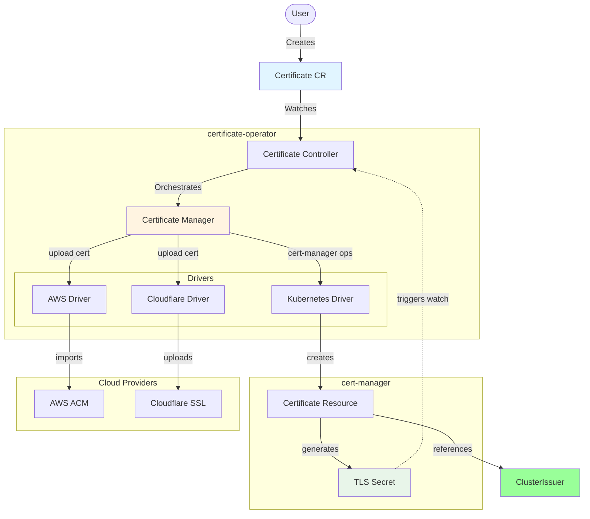
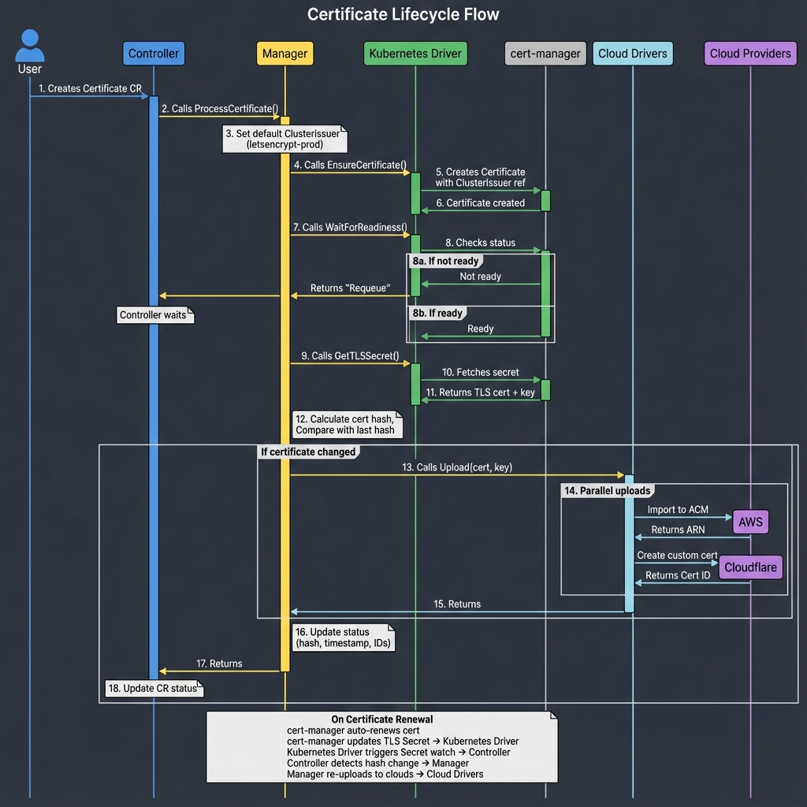

# certificate-operator

Kubernetes operator that automates certificate management using cert-manager and uploads certificates to cloud providers (Cloudflare, AWS ACM).

## Features

- 🔐 **Automatic Certificate Provisioning**: Uses cert-manager with ACME HTTP-01 challenge
- ☁️ **Multi-Cloud Upload**: Automatically uploads to Cloudflare and AWS ACM
- 🔄 **Auto-Renewal Detection**: Detects renewed certificates via SHA256 hash tracking
- 🎯 **Event-Driven**: Secret watch triggers instant reconciliation on certificate changes
- 🏗️ **Clean Architecture**: Driver pattern with dependency injection for better testability
- 🧹 **Automatic Cleanup**: Removes cloud certificates when CR is deleted

## Architecture

### System Overview



### Certificate Lifecycle Flow



**Key Steps:**

1. **Certificate Creation**: User creates Certificate CR, Controller watches and triggers Manager
2. **ClusterIssuer Reference**: Manager sets default ClusterIssuer (letsencrypt-prod) if not specified
3. **cert-manager Integration**: Kubernetes Driver creates cert-manager Certificate with ClusterIssuer reference
4. **Readiness Check**: Waits for Certificate to be ready, requeues if not ready
5. **TLS Secret Retrieval**: Fetches TLS certificate and private key from Secret
6. **Change Detection**: Calculates SHA256 hash and compares with last uploaded certificate
7. **Cloud Upload**: If changed, uploads in parallel to AWS ACM and Cloudflare SSL
8. **Status Update**: Updates CR status with hash, timestamp, and cloud provider IDs
9. **Auto-Renewal**: On certificate renewal, Secret watch triggers automatic re-upload


**Design Principles:**
- Interface-based driver pattern for cloud providers
- Dependency injection for testability
- Separation of concerns (orchestration vs. implementation)
- Event-driven reconciliation via Secret watches


## Prerequisites

- Kubernetes cluster
- [cert-manager](https://cert-manager.io/) installed
- **ClusterIssuer configured** (see setup below)
- Ingress controller (e.g., nginx-ingress)

## Installation

```bash
# Install CRDs
make install

# Deploy operator
make deploy
```

## ClusterIssuer Setup

Before using this operator, you need to create a ClusterIssuer. Here's an example for Let's Encrypt:

### Production ClusterIssuer

```yaml
apiVersion: cert-manager.io/v1
kind: ClusterIssuer
metadata:
  name: letsencrypt-prod
spec:
  acme:
    server: https://acme-v02.api.letsencrypt.org/directory
    email: admin@example.com
    privateKeySecretRef:
      name: letsencrypt-prod-account-key
    solvers:
      - http01:
          ingress:
            ingressClassName: nginx
```

### Staging ClusterIssuer (for testing)

```yaml
apiVersion: cert-manager.io/v1
kind: ClusterIssuer
metadata:
  name: letsencrypt-staging
spec:
  acme:
    server: https://acme-staging-v02.api.letsencrypt.org/directory
    email: admin@example.com
    privateKeySecretRef:
      name: letsencrypt-staging-account-key
    solvers:
      - http01:
          ingress:
            ingressClassName: nginx
```

Apply the ClusterIssuer:

```bash
kubectl apply -f clusterissuer.yaml
```

## Cloud Provider Credentials

Before uploading certificates to cloud providers, you need to create Kubernetes Secrets with the appropriate credentials.

### Cloudflare Credentials

Create a Secret with your Cloudflare API token:

```bash
kubectl create secret generic cloudflare-credentials \
  --from-literal=api-token='your-cloudflare-api-token' \
  -n default
```

Or using YAML:

```yaml
apiVersion: v1
kind: Secret
metadata:
  name: cloudflare-credentials
  namespace: default
type: Opaque
stringData:
  api-token: "your-cloudflare-api-token"
```

**Required Secret Keys:**
- `api-token`: Cloudflare API token with SSL certificate permissions

**How to get Cloudflare API token:**
1. Go to [Cloudflare Dashboard](https://dash.cloudflare.com/profile/api-tokens)
2. Create Token → Use template "Edit zone SSL"
3. Select your zone and create token
4. Copy the token value

**Required Permissions:**
- Zone - SSL and Certificates - Edit

**Additional Requirements:**
- You also need to provide `cloudflareZoneID` in the Certificate spec
- Find your Zone ID in Cloudflare Dashboard → Your Domain → Overview (right sidebar)

### AWS Credentials

#### Option 1: Using IAM Role (Recommended for Production)

Use IRSA (IAM Role for Service Account) or EC2 Instance Profile - no Secret required!

**Required IAM Policy:**
```json
{
  "Version": "2012-10-17",
  "Statement": [
    {
      "Effect": "Allow",
      "Action": [
        "acm:ImportCertificate",
        "acm:DeleteCertificate",
        "acm:AddTagsToCertificate",
        "acm:DescribeCertificate"
      ],
      "Resource": "*"
    }
  ]
}
```

When using IAM Role, simply omit `awsSecretRef` in your Certificate CR.

#### Option 2: Using Static Credentials

Create a Secret with AWS access keys:

```bash
kubectl create secret generic aws-credentials \
  --from-literal=access-key-id='AKIA...' \
  --from-literal=secret-access-key='your-secret-key' \
  --from-literal=region='us-east-1' \
  -n default
```

Or using YAML:

```yaml
apiVersion: v1
kind: Secret
metadata:
  name: aws-credentials
  namespace: default
type: Opaque
stringData:
  access-key-id: "AKIA..."
  secret-access-key: "your-secret-access-key"
  region: "us-east-1"  # Optional - defaults to AWS_REGION or us-east-1
```

**Required Secret Keys:**
- `access-key-id`: AWS Access Key ID (required)
- `secret-access-key`: AWS Secret Access Key (required)
- `region`: AWS region (optional - uses default credential chain if omitted)

**How to create AWS Access Keys:**
1. Go to [AWS IAM Console](https://console.aws.amazon.com/iam/)
2. Users → Your User → Security Credentials
3. Create Access Key → Select "Application running outside AWS"
4. Copy Access Key ID and Secret Access Key

**Security Best Practice:**
- Use IAM Role (Option 1) for production
- Create a dedicated IAM user with minimal permissions for testing only
- Never commit credentials to version control

## Usage

### Basic Certificate

Create a Certificate resource to provision a TLS certificate:

```yaml
apiVersion: certificate.println.kr/v1alpha1
kind: Certificate
metadata:
  name: example-cert
  namespace: default
spec:
  domain: "example.com"
  clusterIssuerName: "letsencrypt-prod"  # Reference existing ClusterIssuer
  # Defaults to "letsencrypt-prod" if not specified
```

### HTTP-01 Solver Configuration

The HTTP-01 solver configuration is managed in your ClusterIssuer, not in the Certificate CR. This allows centralized configuration across all certificates.


### With Cloudflare Upload

1. Create a Secret with Cloudflare credentials:

```yaml
apiVersion: v1
kind: Secret
metadata:
  name: cloudflare-credentials
  namespace: default
type: Opaque
stringData:
  api-token: "your-cloudflare-api-token"
```

**Required Secret Keys:**
- `api-token`: Cloudflare API token with SSL certificate permissions

**Note:** You also need to specify `cloudflareZoneID` in the Certificate spec.

2. Reference the Secret in your Certificate:

```yaml
apiVersion: certificate.println.kr/v1alpha1
kind: Certificate
metadata:
  name: example-cert
  namespace: default
spec:
  domain: "example.com"
  email: "admin@example.com"
  cloudflareSecretRef: "cloudflare-credentials"
  cloudflareZoneID: "your-zone-id-here"
```

### With AWS ACM Upload

#### Option 1: Using IAM Role (Recommended)

For production environments, use IRSA (IAM Role for Service Account) or EC2 Instance Profile:

1. Set up IAM Role with ACM permissions:
```json
{
  "Version": "2012-10-17",
  "Statement": [
    {
      "Effect": "Allow",
      "Action": [
        "acm:ImportCertificate",
        "acm:DeleteCertificate",
        "acm:AddTagsToCertificate"
      ],
      "Resource": "*"
    }
  ]
}
```

2. Reference in Certificate (no Secret needed):
```yaml
apiVersion: certificate.println.kr/v1alpha1
kind: Certificate
metadata:
  name: example-cert
  namespace: default
spec:
  domain: "example.com"
  email: "admin@example.com"
  # awsSecretRef is omitted - will use IAM Role
```

**Note:** When `awsSecretRef` is omitted, the operator uses AWS default credential chain (IRSA → Instance Profile → Environment variables).

#### Option 2: Using Static Credentials

1. Create a Secret with AWS credentials:

```yaml
apiVersion: v1
kind: Secret
metadata:
  name: aws-credentials
  namespace: default
type: Opaque
stringData:
  access-key-id: "AKIA..."
  secret-access-key: "..."
  region: "us-east-1"  # Optional
```

**Required Secret Keys:**
- `access-key-id`: AWS Access Key ID (required)
- `secret-access-key`: AWS Secret Access Key (required)
- `region`: AWS region (optional - uses default chain if omitted)

2. Reference the Secret in your Certificate:

```yaml
apiVersion: certificate.println.kr/v1alpha1
kind: Certificate
metadata:
  name: example-cert
  namespace: default
spec:
  domain: "example.com"
  email: "admin@example.com"
  awsSecretRef: "aws-credentials"
```

### Complete Example (Both Providers)

```yaml
apiVersion: certificate.println.kr/v1alpha1
kind: Certificate
metadata:
  name: example-cert
  namespace: default
spec:
  domain: "example.com"
  email: "admin@example.com"
  ingressClassName: "nginx"
  cloudflareSecretRef: "cloudflare-credentials"
  cloudflareZoneID: "your-zone-id-here"
  awsSecretRef: "aws-credentials"
```

## How It Works

### Certificate Lifecycle

1. **Issuer Creation**: Operator creates a cert-manager Issuer (ACME staging by default)
2. **Certificate Request**: Creates a cert-manager Certificate resource
3. **Readiness Check**: Polls until Issuer and Certificate are ready
4. **Secret Retrieval**: Fetches the generated TLS certificate from the Secret
5. **Certificate Hashing**: Calculates SHA256 hash for change detection
6. **Cloud Upload**: Uploads to configured cloud providers (if hash changed)
7. **Status Update**: Updates CR status with ARN/IDs and upload timestamps

### Automatic Renewal

The operator automatically detects and handles certificate renewals:

- **Hash Tracking**: Stores SHA256 hash of uploaded certificates
- **Secret Watch**: Monitors TLS Secrets for changes (no polling needed)
- **Smart Re-upload**: Only re-uploads when certificate content changes
- **AWS Re-import**: Uses same ARN for renewals (no new ARN)
- **Cloudflare Replace**: Deletes old cert and uploads new one

### Deletion Handling

When a Certificate CR is deleted:
- Finalizer ensures proper cleanup
- Deletes certificate from AWS ACM (if uploaded)
- Deletes certificate from Cloudflare (if uploaded)
- cert-manager resources deleted automatically (owner references)

## CRD Specification

| Field | Type | Required | Description |
|-------|------|----------|-------------|
| `domain` | string | Yes | Domain name for the certificate |
| `email` | string | Yes | Email for ACME registration |
| `issuerName` | string | No | Custom Issuer name (defaults to `default-issuer`) |
| `ingressClassName` | string | No | Ingress class for HTTP-01 solver (defaults to `nginx`) |
| `cloudflareSecretRef` | string | No | Secret name containing Cloudflare credentials |
| `cloudflareZoneID` | string | Conditional | Cloudflare zone ID (required if using Cloudflare) |
| `cloudflareEnabled` | bool | No | Enable/disable Cloudflare upload (defaults to true if secret is set) |
| `awsSecretRef` | string | No | Secret name containing AWS credentials (omit for IRSA) |
| `awsEnabled` | bool | No | Enable/disable AWS upload (defaults to true) |

### Usage Examples

**Disable AWS upload temporarily:**
```yaml
spec:
  domain: "example.com"
  email: "admin@example.com"
  awsSecretRef: "aws-credentials"
  awsEnabled: false  # Temporarily disable
```

**Use only Cloudflare:**
```yaml
spec:
  domain: "example.com"
  email: "admin@example.com"
  cloudflareSecretRef: "cloudflare-credentials"
  cloudflareZoneID: "your-zone-id"
  # awsSecretRef omitted - AWS upload disabled
```

## Status Fields

| Field | Type | Description |
|-------|------|-------------|
| `issuerRef` | string | Name of the created Issuer |
| `certificateRef` | string | Name of the created cert-manager Certificate |
| `cloudflareUploaded` | bool | True if uploaded to Cloudflare |
| `cloudflareCertificateID` | string | Cloudflare certificate ID |
| `awsUploaded` | bool | True if uploaded to AWS ACM |
| `awsCertificateARN` | string | AWS ACM certificate ARN |
| `lastUploadedCertHash` | string | SHA256 hash of last uploaded certificate |
| `lastUploadedTime` | timestamp | Time of last successful upload |

## Development

### Running Locally

```bash
# Run tests
make test

# Build locally
make build

# Run locally (requires kubeconfig)
make run
```

### Architecture

The operator uses a driver pattern for extensibility:

- **`internal/driver/types/`**: Interface definitions
- **`internal/driver/kubernetes/`**: cert-manager driver
- **`internal/driver/aws/`**: AWS ACM driver  
- **`internal/driver/cloudflare/`**: Cloudflare SSL driver
- **`internal/driver/manager.go`**: Orchestrates all drivers

**Adding a New Provider:**
1. Implement the `CloudProvider` interface
2. Create new driver package under `internal/driver/`
3. Add to `CertificateManager.uploadToCloudProviders()`

## REST API Server

The operator includes a built-in REST API server for managing Certificate resources via HTTP.

### Features

- 🌐 **RESTful API**: Full CRUD operations for Certificate resources
- 📚 **Swagger UI**: Interactive API documentation at `/swagger/index.html`
- 🔍 **Health Check**: Kubernetes-style health endpoint at `/healthz`
- 🚀 **Goroutine Integration**: Runs alongside the operator in the same process

### Enabling the API Server

The API server is **enabled by default** on port 8080. You can configure it using command-line flags:

```bash
# Run with default settings (port 8080, enabled)
./manager

# Custom port
./manager --api-server-port=9090

# Disable API server
./manager --enable-api-server=false
```

### API Endpoints

| Method | Endpoint | Description |
|--------|----------|-------------|
| `GET` | `/healthz` | Health check |
| `GET` | `/swagger/*` | Swagger UI documentation |
| `POST` | `/api/v1/certificates` | Create a Certificate |
| `GET` | `/api/v1/certificates` | List all Certificates (all namespaces) |
| `GET` | `/api/v1/namespaces/{namespace}/certificates` | List Certificates in namespace |
| `GET` | `/api/v1/namespaces/{namespace}/certificates/{name}` | Get a Certificate |
| `PUT` | `/api/v1/namespaces/{namespace}/certificates/{name}` | Update a Certificate |
| `DELETE` | `/api/v1/namespaces/{namespace}/certificates/{name}` | Delete a Certificate |

### Usage Examples

#### Health Check

```bash
curl http://localhost:8080/healthz
# Response: {"status":"healthy"}
```

#### Swagger UI

Access the interactive API documentation in your browser:
```
http://localhost:8080/swagger/index.html
```

#### Create Certificate

```bash
curl -X POST http://localhost:8080/api/v1/certificates \
  -H "Content-Type: application/json" \
  -d '{
    "name": "api-example-cert",
    "namespace": "default",
    "domain": "api.example.com",
    "clusterIssuerName": "letsencrypt-prod",
    "cloudflareSecretRef": "cloudflare-credentials",
    "cloudflareZoneID": "your-zone-id"
  }'
```

#### List Certificates

```bash
# All namespaces
curl http://localhost:8080/api/v1/certificates

# Specific namespace
curl http://localhost:8080/api/v1/namespaces/default/certificates
```

#### Get Certificate

```bash
curl http://localhost:8080/api/v1/namespaces/default/certificates/api-example-cert
```

#### Update Certificate

```bash
curl -X PUT http://localhost:8080/api/v1/namespaces/default/certificates/api-example-cert \
  -H "Content-Type: application/json" \
  -d '{
    "domain": "updated.example.com",
    "cloudflareEnabled": false
  }'
```

#### Delete Certificate

```bash
curl -X DELETE http://localhost:8080/api/v1/namespaces/default/certificates/api-example-cert
```

### Accessing API Server in Kubernetes

If the operator is running in a Kubernetes cluster, use port-forwarding to access the API:

```bash
# Port forward to local machine
kubectl port-forward -n certificate-operator-system \
  deployment/certificate-operator-controller-manager 8080:8080

# Then access locally
curl http://localhost:8080/healthz
```

### Generating Swagger Documentation

Before deploying, generate Swagger documentation:

```bash
make swagger
```

This creates API documentation in the `docs/` directory, which is served by the API server.

## Troubleshooting

**Certificate not uploading to cloud:**
- Check Secret exists and has correct keys
- Verify credentials have proper permissions
- Check operator logs: `kubectl logs -n certificate-operator-system deployment/certificate-operator-controller-manager`

**Renewal not working:**
- Secret watch triggers reconciliation automatically
- Check if TLS Secret was updated by cert-manager
- Verify hash changed in status: `kubectl get certificate example-cert -o yaml`

## License

Apache License 2.0
